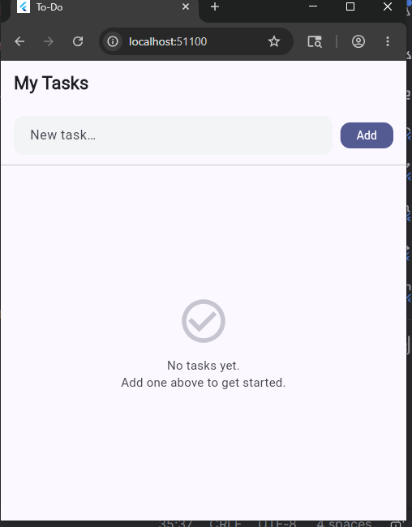

# Flutter BLoC Todo App

A modern Todo application built with Flutter.

## Features

- Add task
- Edit task
- Delete task
- Mark task completed
- BLoC state management
- Repository pattern
- Equatable models

## Tech Stack

- Flutter
- Dart
- flutter_bloc
- Equatable

## Architecture

UI Layer
↓
Bloc Layer
↓
Repository Layer
↓
Model Layer

## Screenshots

